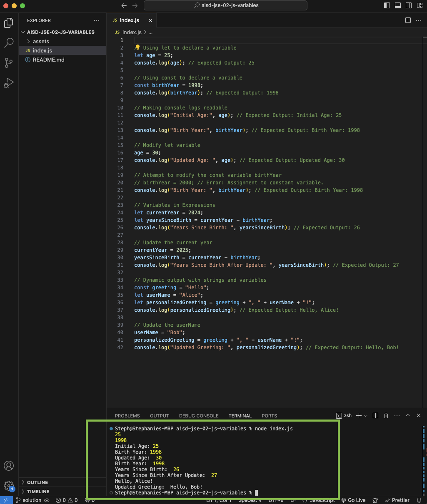
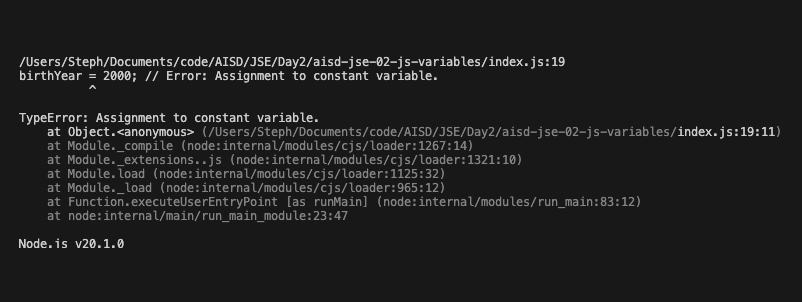

# JavaScript Variables



## Description 📄

In this project, you'll dive into key JavaScript concepts, focusing on the differences between variable types `let` and `const` and how to use them effectively. You'll see how `let` allows you to reassign values while `const` keeps them fixed, and practice making console outputs clearer and more readable. Through hands-on examples, you'll manipulate variables, use them in expressions, and combine them to create dynamic content. By the end, you'll know when to choose `let` or `const` and how to use them confidently in your code.

## Expected Project Structure 🏗️

```
JavaScriptVariables/
└── index.js
```

# Instructions ✅

## 1. **Create the Project Folder and Files**

- [ ] Create a folder named `JavaScriptVariables` to store all your project files.
- [ ] Inside the `JavaScriptVariables` folder, create a file named `index.js`. This will be your main JavaScript file.

## 2. **Set Up JavaScript Variables**

Variables are used to store data values. In JavaScript, you can declare variables using `let` or `const`.

- [ ] In your `index.js` file, add the following code:

```js
// Using let to declare a variable
let age = 25; 
console.log(age); // Expected Output: 25

// Using const to declare a variable
const birthYear = 1998;
console.log(birthYear); // Expected Output: 1998
```

- [ ] See your code in action: Run the JavaScript file in your terminal by entering the command `node index.js` and pressing Enter.

**Explanation:**
- `let` is used for variables that can be reassigned and allows us to change the value later if needed.
- `const` declares a constant value, meaning it cannot be reassigned.

## 3. **Make Your Console Logs More Readable**

Currently, the `console.log()` outputs only the variable value. To make the output more readable, you can add strings to provide context.

- [ ] In your `index.js` file, update your `console.log()` statements to the following:

```js
// Making console logs readable 
console.log("Initial Age:", age); // Expected Output: Initial Age: 25

console.log("Birth Year:", birthYear); // Expected Output: Birth Year: 1998
```

- [ ] See your code in action: Run the JavaScript file in your terminal by entering the command `node index.js` and pressing Enter.

**Explanation:**
- Now our `console.log()` statements use a string and a variable to provide a clearer message in the console.

## 4. **Explore `let` in Action**
Let's modify the `age` variable declared with `let` and observe the behavior of `const`:

- [ ] In your `index.js` file, change the value of the `age` variable to 2000 by by creating a new line that reassigns the variable, rather than modifying the original line where it is declared. Add the following to your code:

```js
// Modify let variable
age = 30; 
console.log("Updated Age: ", age); // Expected Output: Updated Age: 30
```

- [ ] See your code in action: Run the JavaScript file in your terminal by entering the command `node index.js` and pressing Enter.

**Explanation:**
- `age` is declared with `let`, so we were able to modify its value to 30.


## 5. **Explore `const` in Action**
Now, let's observe what happens when you try to modify a `const` variable.

- [ ] In your `index.js` file, try changing the value of the `birthYear` variable to 2000 by adding the following to your code:

```js
// Attempt to modify the const variable birthYear
birthYear = 2000; // Error: Assignment to constant variable.
console.log("Birth Year: ", birthYear); // Expected Output: Birth Year: 1998
```
- [ ] See your code in action: Run the JavaScript file in your terminal by entering the command `node index.js` and pressing Enter.
- [ ] After running your code, you should see the following `TypeError` in your terminal:



- [ ] Comment out the line of code that attempts to modify the value of the `const` variable `birthYear`. Otherwise, you will continue to get an error every time you run your JavaScript file.

**Explanation:**
- `birthYear` is declared with `const`, so any attempt to change its value will result in an error.

## 6. **Apply Variables in Expressions**

Let's see how you can use variables in mathematical expressions to perform calculations and dynamically update values.

- [ ] In your `index.js` file, add the following code:

```js
// Variables in Expressions
let currentYear = 2024;
let yearsSinceBirth = currentYear - birthYear;
console.log("Years Since Birth: ", yearsSinceBirth); // Expected Output: 26
```

- [ ] In your `index.js` file, change the value of the `currentYear` variable to 2025 by creating a new line that reassigns the variable, rather than modifying the original line where it is declared. Add the following to your code:

```js
// Update the current year
currentYear = 2025;
yearsSinceBirth = currentYear - birthYear;
console.log("Years Since Birth After Update: ", yearsSinceBirth); // Expected Output: 27
```

- [ ] See your code in action: Run the JavaScript file in your terminal by entering the command `node index.js` and pressing Enter.

**Explanation:**
- This example shows how `let` allows for reassigning new values and using them in expressions.
- When `currentYear` is updated, the calculation automatically reflects the change.

## 7. **Build Dynamic Outputs with Strings and Variables**

To make your output more dynamic and interactive, you can combine string variables with constants to create customized messages.

- [ ] In your `index.js` file, add the following code:

```js
// Dynamic output with strings and variables
const greeting = "Hello";
let userName = "Alice";
let personalizedGreeting = greeting + ", " + userName + "!";
console.log(personalizedGreeting); // Expected Output: Hello, Alice!
```

- [ ] In your `index.js` file, change the value of the `userName` variable to "Bob" by creating a new line that reassigns the variable, rather than modifying the original line where it is declared. Add the following to your code:

```js

// Update the userName
userName = "Bob";
personalizedGreeting = greeting + ", " + userName + "!";
console.log("Updated Greeting: ", personalizedGreeting); // Expected Output: Hello, Bob!
```
- [ ] See your code in action: Run the JavaScript file in your terminal by entering the command `node index.js` and pressing Enter.

**Explanation:**
- Our `const` variable `greeting` is not changed, while our `let` variable `userName` can be reassigned.
- The `+ ", " + ` adds a comma and a space between the greeting and the user's name, making the message more readable.
- The `+ "!" `adds an exclamation point at the end of the message, adding emphasis and making the greeting feel more enthusiastic.
- The output demonstrates how we can construct a dynamic greeting message that updates based on the value of `userName`.

## 8. **Decide Which Variable Type to Use**
Understanding when to use `let` versus `const` helps ensure your code is clear, efficient, and less prone to errors.

- [ ] In general, you should use `const` by default to declare your variables. This practice ensures that you don't accidentally change the value of a variable without intending to, providing a safeguard for your code.
- [ ] Use `let` when you know the variable's value will need to change or be reassigned later. For example, if you are working with values that update over time, like counters or player scores, `let` is the appropriate choice.

## 10. **Commit and Push to Github**
- [ ] Commit and push your work to Github.

##

# Conclusion 📄

Congratulations! You've learned the key differences between `let` and `const` in JavaScript, including when to use each for reassignment or fixed values. You've practiced combining variables and constants for dynamic messages, used variables in mathematical expressions, and learned how to choose the right variable type for more secure and predictable code. With these skills, you're now ready to write clearer and more dynamic JavaScript.

##

### Solution codebase 👀
🛑 **Only use this as a reference** 🛑

💾 **Not something to copy and paste** 💾

**Note:**  This lab references a solution file located [here](https://github.com/HackerUSA-CE/aisd-jse-02-js-variables/tree/solution) (link not shown).


---

© All rights reserved to ThriveDX
